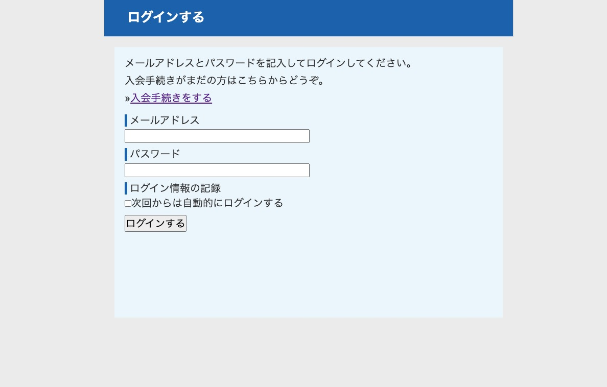

# 概要  
よくわかるPHPの教科書をもとに掲示板アプリを作成  
[「よくわかるPHPの教科書」の詳細へ](https://book.mynavi.jp/ec/products/detail/id=89743)

> ログイン画面



> 投稿一覧画面


# 使用技術


 

# 掲示板の機能一覧
- 会員登録 
- ログイン、ログアウト 
- 投稿
- 投稿に対する返信
- 投稿の削除

# 環境構築

> Dockerのインストール
  
**※インストール済みの方は飛ばしてください。**

[Dockerをインストールする](https://www.docker.com/)

> Dockerコンテナ起動

```
docker-compose up -d
```

> 掲示板アプリへのアクセス

```
http://localhost:8000/post
```

> phpMyAdminへのアクセス

```
http://localhost:8080
```